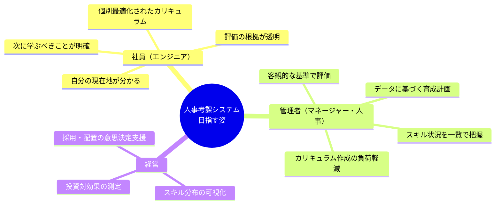
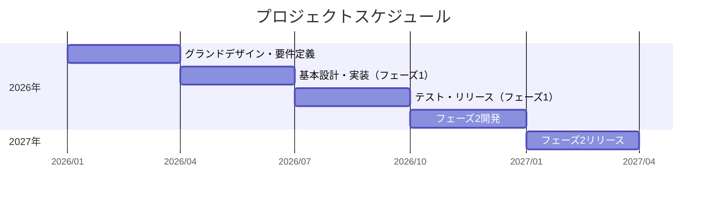

# プロジェクト概要

---

## 1. プロジェクト名

**トキワテック 人事考課システム**

---

## 2. 背景

### 現状の課題

| 課題                 | 詳細                                                     |
| -------------------- | -------------------------------------------------------- |
| 評価の不透明性       | 評価基準が曖昧で、社員が「なぜこの評価か」を理解できない |
| スキル成長の属人化   | 何を学べば昇格できるかが明確でなく、成長が個人任せ       |
| 教育コンテンツの不足 | 体系的なカリキュラムがなく、OJT依存                      |
| 管理の非効率         | Excel/スプレッドシートでの評価管理に限界                 |

### 組織の状況

- 社員数：約30名（エンジニア中心）
- 職級：L1〜L5の5段階
- 評価サイクル：年次評価

---

## 3. ビジョン

> **透明性と納得性のある評価制度により、エンジニアが自律的に成長できる組織を実現する**

### 目指す姿

---

## 4. プロジェクト目標

### 定性目標

1. **評価の透明性向上** - 評価基準とロードマップを連動させ、「なぜこの評価か」を説明可能にする
2. **自律的成長の支援** - 社員が自分で学習計画を立てられる環境を提供
3. **管理負荷の軽減** - 評価・カリキュラム作成の工数を削減

### 定量目標（KPI案）

| 指標                                 | 現状   | 目標     |
| ------------------------------------ | ------ | -------- |
| 評価に対する納得度（社員アンケート） | 未測定 | 80%以上  |
| スキル達成率の可視化                 | 0%     | 100%     |
| カリキュラム作成工数                 | 手動   | 50%削減  |
| 昇格試験合格率                       | 未測定 | 測定開始 |

---

## 5. 成功基準

### フェーズ1（MVP）の成功基準

- [ ] 全社員のスキル達成状況が可視化されている
- [ ] 年次評価がシステム上で完結する
- [ ] 管理者がカリキュラムを生成できる

### フェーズ2の成功基準

- [ ] 社員が自分のスキルマップを確認できる
- [ ] カリキュラム完了率が追跡できる
- [ ] LLMによるカリキュラム生成が稼働

---

## 6. プロジェクト体制

| 役割                     | 担当       | 責務                       |
| ------------------------ | ---------- | -------------------------- |
| プロジェクトオーナー     | （要決定） | 最終意思決定、リソース確保 |
| プロジェクトマネージャー | （要決定） | 進捗管理、課題解決         |
| 業務担当（人事）         | （要決定） | 業務要件の提供、受入確認   |
| 開発担当                 | （要決定） | 設計・実装                 |

---

## 7. スケジュール概要

---

## 8. リスク

| リスク             | 影響度 | 対策                                    |
| ------------------ | ------ | --------------------------------------- |
| 要件の膨張         | 高     | MVPを明確に定義し、スコープを厳格に管理 |
| LLM生成品質        | 中     | 有識者査閲プロセスを必須化              |
| 社員の利用定着     | 中     | UI/UXの簡素化、段階的導入               |
| Neo4j Auraのコスト | 低     | Free Tierで開始、スケール時に見直し     |

---

_作成日: 2026年1月24日_ _トキワテック 人事考課システム_
