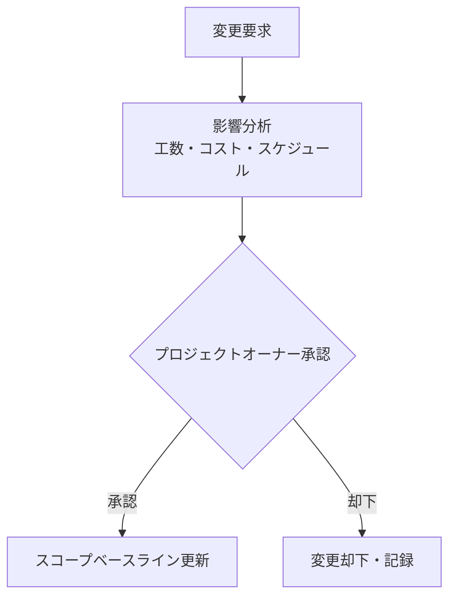

# スコープ定義

---

## 1. プロジェクトスコープ概要

### スコープ内（In-Scope）

#### 🔷 フェーズ1 - MVP

| 機能                     | 概要                                           |
| ------------------------ | ---------------------------------------------- |
| 職級・スキルマップ管理   | L1〜L5の職級、スキルカテゴリ、スキル項目の定義 |
| 評価入力・算出           | 達成状況の入力、評価スコアの自動算出           |
| スキル達成状況の可視化   | 社員×スキルの達成状況をマトリクス表示          |
| 管理者向けダッシュボード | 部下一覧、統計、アラート                       |

#### 🔶 フェーズ2 - 拡張

| 機能                    | 概要                                     |
| ----------------------- | ---------------------------------------- |
| 社員向けポータル        | 自分のスキルマップ・達成状況を確認       |
| LLMカリキュラム自動生成 | 未達成スキルに基づく個別カリキュラム生成 |
| 学習進捗トラッキング    | カリキュラム項目の完了状態を追跡         |
| ナレッジシステム連携    | 外部ナレッジシステムとのAPI連携          |
| 承認ワークフロー        | 評価・昇格の多段階承認                   |
| 360度フィードバック     | ピアレビュー機能                         |

#### ⚪ フェーズ3 - 将来構想

| 機能                 | 概要                                        |
| -------------------- | ------------------------------------------- |
| スキルベース採用支援 | 不足スキルに基づく採用要件の自動生成        |
| スキルギャップ分析   | 組織全体のスキル分布と目標のギャップ可視化  |
| 外部学習PF連携       | Udemy、Coursera等の学習プラットフォーム連携 |

### スコープ外（Out-of-Scope）

| 項目     | 理由                               |
| -------- | ---------------------------------- |
| 給与計算 | 既存給与システムの領域             |
| 勤怠管理 | 別システムで対応（連携は将来検討） |
| 採用管理 | スコープ拡大を避けるため除外       |
| 退職予測 | プライバシー・倫理面の懸念         |

---

## 2. フェーズ別詳細スコープ

### フェーズ1（MVP）

**目的**: 最小限の機能で評価業務をシステム化し、価値を検証する

| 機能                 | 詳細                                | 優先度 |
| -------------------- | ----------------------------------- | ------ |
| 職級マスタ管理       | L1〜L5の職級・要件を登録・編集      | 必須   |
| スキル定義管理       | スキルカテゴリ・スキル項目の登録    | 必須   |
| ロードマップ管理     | 職級×スキルのロードマップ項目を登録 | 必須   |
| 社員情報管理         | 社員の基本情報・所属職級を管理      | 必須   |
| 達成状況登録         | 社員のスキル達成状況を入力          | 必須   |
| 評価シート           | 達成率に基づく評価スコア算出        | 必須   |
| 管理者ダッシュボード | 部下の達成状況一覧・統計            | 必須   |

**対象ユーザー**: 管理者（人事・マネージャー）のみ

**デリバリー目標**: 2026年Q3

---

### フェーズ2（拡張）

**目的**: 社員自身が活用できるポータルと、カリキュラム自動生成を実現

| 機能                | 詳細                               | 優先度 |
| ------------------- | ---------------------------------- | ------ |
| 社員ポータル        | 自分のスキルマップ・達成状況を確認 | 必須   |
| カリキュラム生成    | LLMによる個別学習カリキュラム生成  | 必須   |
| 学習進捗管理        | カリキュラム項目の完了状態を追跡   | 必須   |
| ナレッジ管理        | Article/Book/Scrapの作成・共有     | 必須   |
| 情報ソース連携      | 学習リソースへのリンク・MCP連携    | 高     |
| 360度フィードバック | ピアレビュー機能                   | 中     |
| 通知機能            | 評価期限・カリキュラム推奨         | 中     |

**対象ユーザー**: 全社員

**デリバリー目標**: 2027年Q1

---

### フェーズ3（将来構想）

**目的**: 戦略的人材管理への発展

| 機能                         | 詳細                                        |
| ---------------------------- | ------------------------------------------- |
| スキルギャップ分析           | 組織全体のスキル分布と目標のギャップ可視化  |
| 採用要件連携                 | 不足スキルに基づく採用要件の自動生成        |
| 外部連携                     | Udemy、Coursera等の学習プラットフォーム連携 |
| キャリアパスシミュレーション | 異なるキャリアパスでの成長シミュレーション  |

---

## 3. データスコープ

### 管理対象データ

| データ           | フェーズ1 | フェーズ2 | 説明                             |
| ---------------- | --------- | --------- | -------------------------------- |
| 職級（Grade）    | ✅        | ✅        | L1〜L5の定義                     |
| スキルカテゴリ   | ✅        | ✅        | テクニカル/ビジネス/マネジメント |
| スキル（Skill）  | ✅        | ✅        | 具体的なスキル項目               |
| ロードマップ項目 | ✅        | ✅        | 職級×スキルの習得目標            |
| 社員（Employee） | ✅        | ✅        | 社員マスタ                       |
| 達成状況         | ✅        | ✅        | 社員×ロードマップ項目            |
| 情報ソース       | ✅        | ✅        | 学習リソースのURL・種別          |
| カリキュラム割当 | -         | ✅        | 外部Book IDへの参照、割当情報    |
| 学習進捗         | -         | ✅        | カリキュラムの完了状態           |
| フィードバック   | -         | ✅        | 360度評価の回答                  |

**外部システム連携（フェーズ2）**:

| 連携先           | データ | 説明                         |
| ---------------- | ------ | ---------------------------- |
| ナレッジシステム | Book   | カリキュラムの実体を外部管理 |

### Neo4jスキーマ（現状）

```cypher
// ノード
(:Grade)               // 5件
(:SkillCategory)       // 3件
(:Skill)               // 15件
(:RoadmapItem)         // 82件
(:InformationSource)   // 16件

// リレーションシップ
(:RoadmapItem)-[:REQUIRES]->(:Skill)
(:RoadmapItem)-[:FOR_GRADE]->(:Grade)
(:Skill)-[:BELONGS_TO]->(:SkillCategory)
(:RoadmapItem)-[:LEARNS_FROM]->(:InformationSource)
```

---

## 4. 技術スコープ

### 採用技術スタック

| レイヤー       | 技術                    | 選定理由                     |
| -------------- | ----------------------- | ---------------------------- |
| フロントエンド | Cloudflare Pages        | 高速配信、無料枠が充実       |
| バックエンド   | Cloudflare Workers      | サーバーレス、低コスト       |
| RDB            | Cloudflare D1           | Workers連携、SQLite互換      |
| グラフDB       | Neo4j Aura              | スキル関係のモデリングに最適 |
| LLM            | Claude / Amazon Bedrock | カリキュラム生成、MCP対応    |

### 技術スコープ境界

**スコープ内**:

- Webアプリケーション（SPA）
- REST API / GraphQL（検討中）
- Neo4j AuraDB（Free Tier）
- Cloudflare環境

**スコープ外**:

- モバイルアプリ（Webレスポンシブで対応）
- オンプレミス環境
- Google Chat連携（将来検討）

---

## 5. スコープ変更管理

### 変更承認プロセス



### スコープクリープ防止策

1. **MVP優先**: 「Nice to have」は全てフェーズ2以降に分類
2. **ユーザーストーリーマッピング**: 機能は必ずユーザーストーリーに紐付け
3. **定期レビュー**: 2週間ごとにスコープ確認

---

_作成日: 2026年1月24日_ _トキワテック 人事考課システム_
