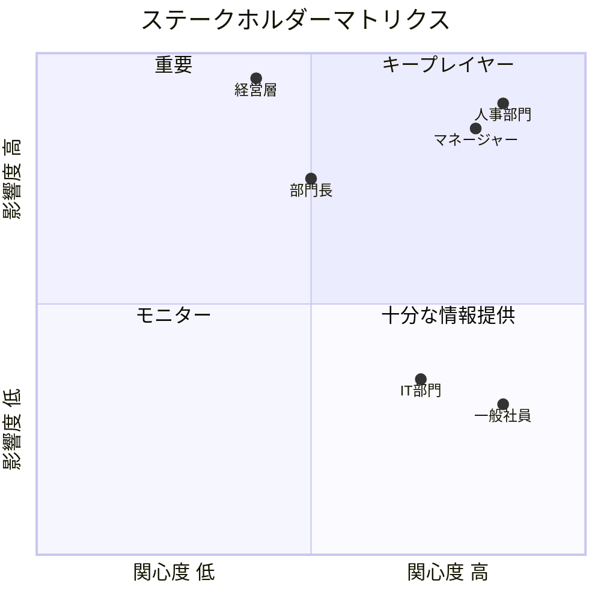
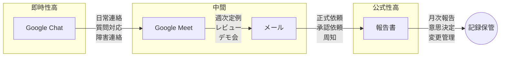

# ステークホルダー

---

## 1. ステークホルダーマップ



---

## 2. ステークホルダー一覧

### 2.1 キープレイヤー（高関心・高影響）

#### 人事部門

| 項目                   | 内容                                              |
| ---------------------- | ------------------------------------------------- |
| **役割**               | 評価制度の運用主体、システム主管部門              |
| **関心事**             | 評価業務の効率化、公平性の担保、データ活用        |
| **期待**               | Excel脱却、評価根拠の可視化、カリキュラム作成支援 |
| **懸念**               | システム移行の負荷、運用体制、データ移行          |
| **関与方法**           | 要件定義への参画、受入テスト、運用設計            |
| **コミュニケーション** | 週次ミーティング、Google Chat                     |

#### マネージャー（評価者）

| 項目                   | 内容                                                 |
| ---------------------- | ---------------------------------------------------- |
| **役割**               | 部下の評価入力、1on1での育成支援                     |
| **関心事**             | 評価作業の工数削減、部下の成長支援                   |
| **期待**               | 簡単な入力UI、部下のスキル状況一覧、カリキュラム提案 |
| **懸念**               | 入力負荷増加、評価基準の変更                         |
| **関与方法**           | ユーザーインタビュー、β版テスト                      |
| **コミュニケーション** | 月次進捗共有、デモ会                                 |

---

### 2.2 重要（高影響・中〜低関心）

#### 経営層

| 項目                   | 内容                                         |
| ---------------------- | -------------------------------------------- |
| **役割**               | 最終意思決定、リソース配分                   |
| **関心事**             | 人材育成の投資対効果、組織のスキル競争力     |
| **期待**               | 組織スキル分布の可視化、データ駆動の人材戦略 |
| **懸念**               | コスト、導入効果の不確実性                   |
| **関与方法**           | マイルストーン報告、意思決定エスカレーション |
| **コミュニケーション** | 月次報告書、四半期レビュー                   |

#### 部門長

| 項目                   | 内容                                     |
| ---------------------- | ---------------------------------------- |
| **役割**               | 部門の評価方針決定、マネージャー支援     |
| **関心事**             | 部門メンバーのスキル底上げ、評価の一貫性 |
| **期待**               | 部門全体のスキル状況把握、評価の標準化   |
| **懸念**               | 評価基準の変更による混乱                 |
| **関与方法**           | 要件レビュー、方針確認                   |
| **コミュニケーション** | 隔週状況共有                             |

---

### 2.3 十分な情報提供（高関心・低影響）

#### 一般社員（被評価者）

| 項目                   | 内容                                                     |
| ---------------------- | -------------------------------------------------------- |
| **役割**               | 評価対象、学習者                                         |
| **関心事**             | 自分の評価、キャリアパス、何を学べばよいか               |
| **期待**               | 評価の透明性、成長ロードマップの明確化、個別カリキュラム |
| **懸念**               | 評価基準の変更、過去評価との整合性                       |
| **関与方法**           | ユーザーインタビュー（フェーズ2）、β版テスト             |
| **コミュニケーション** | 全社説明会、FAQ、ポータル                                |

#### IT部門

| 項目                   | 内容                                       |
| ---------------------- | ------------------------------------------ |
| **役割**               | 技術支援、インフラ管理                     |
| **関心事**             | システム安定稼働、セキュリティ、運用負荷   |
| **期待**               | SaaS活用による運用負荷軽減、明確な技術要件 |
| **懸念**               | 新技術の学習コスト、障害対応体制           |
| **関与方法**           | アーキテクチャレビュー、セキュリティ確認   |
| **コミュニケーション** | 技術ミーティング                           |

---

## 3. RACI マトリクス

| 活動             | 経営層 | 人事 | マネージャー | 一般社員 | IT部門 | 開発 |
| ---------------- | ------ | ---- | ------------ | -------- | ------ | ---- |
| プロジェクト承認 | A      | R    | I            | I        | I      | C    |
| 業務要件定義     | I      | A/R  | C            | I        | I      | C    |
| システム要件定義 | I      | C    | I            | I        | C      | A/R  |
| 設計・実装       | I      | I    | I            | -        | C      | A/R  |
| ユーザーテスト   | I      | A    | R            | R        | C      | C    |
| 運用設計         | I      | A/R  | I            | I        | R      | C    |
| データ移行       | I      | A    | C            | -        | R      | R    |
| 利用者教育       | I      | A/R  | R            | -        | C      | C    |

**凡例**: R=実行責任, A=説明責任, C=相談, I=報告

---

## 4. コミュニケーション計画

### 定例コミュニケーション

| 対象         | 頻度             | 形式             | 内容                         |
| ------------ | ---------------- | ---------------- | ---------------------------- |
| 経営層       | 月次             | 報告書           | 進捗・課題・予算状況         |
| 人事部門     | 週次             | ミーティング     | 詳細進捗・要件確認           |
| マネージャー | 隔週             | メール+デモ      | 機能紹介・フィードバック収集 |
| 一般社員     | マイルストーン時 | 全社説明会       | 概要・スケジュール・期待効果 |
| IT部門       | 隔週             | 技術ミーティング | アーキテクチャ・セキュリティ |

### コミュニケーションチャネル



```

---

## 5. 期待管理

### ステークホルダー別の期待とマネジメント

| ステークホルダー | 期待           | マネジメント方針                     |
| ---------------- | -------------- | ------------------------------------ |
| 経営層           | 短期ROI        | MVPで早期価値実証、定量効果を報告    |
| 人事部門         | 全機能実装     | フェーズ分けを明確化、優先順位を合意 |
| マネージャー     | 工数削減       | UI/UXをシンプルに、入力負荷を最小化  |
| 一般社員         | 即座に利用可能 | フェーズ2でポータル提供を約束        |

### リスク：期待のミスマッチ

| リスク           | 発生要因             | 対策                             |
| ---------------- | -------------------- | -------------------------------- |
| 機能不足の不満   | スコープの認識齟齬   | 早期にスコープを文書化・合意     |
| 導入効果への疑問 | KPI未設定            | 定量目標を設定し、効果測定を実施 |
| 変更への抵抗     | 現行プロセスへの愛着 | チェンジマネジメント、段階的移行 |

---

## 6. 承認者・意思決定権限

| 意思決定事項          | 承認者                      | エスカレーション先   |
| --------------------- | --------------------------- | -------------------- |
| プロジェクト続行/中止 | 経営層                      | -                    |
| スコープ変更          | プロジェクトオーナー        | 経営層               |
| 技術選定              | 開発リード                  | プロジェクトオーナー |
| 業務要件の優先順位    | 人事部門                    | プロジェクトオーナー |
| リリース判定          | プロジェクトオーナー + 人事 | -                    |

---

_作成日: 2026年1月24日_ _トキワテック 人事考課システム_
```
