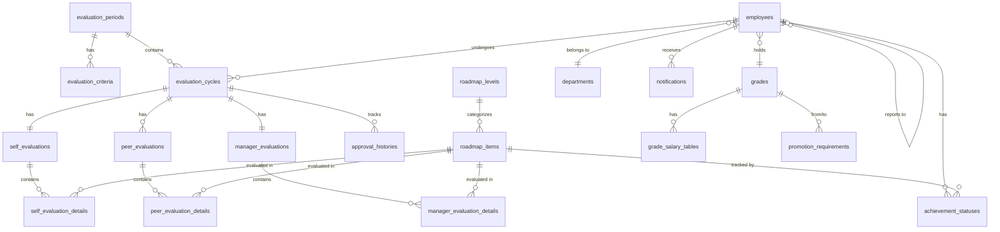

# ドメインモデル定義

本ドキュメントは、人事考課システムのドメインモデルを定義します。

> **注意**: 本ドキュメントはNeo4jオントロジーから派生しています。不整合が発生した場合は、オントロジーを正とします。オントロジー設計書:
> [02\_オントロジー設計.md](../../00_概要/02_オントロジー設計.md)

---

## 1. ドメイン全体像

```
┌─────────────────────────────────────────────────────────────────────┐
│                       人事考課システム                               │
├─────────────────────────────────────────────────────────────────────┤
│                                                                     │
│  ┌─────────────────┐  ┌─────────────────┐  ┌─────────────────┐    │
│  │   評価ドメイン   │  │  スキルドメイン  │  │  組織ドメイン   │    │
│  ├─────────────────┤  ├─────────────────┤  ├─────────────────┤    │
│  │ ・評価期間      │  │ ・ロードマップ   │  │ ・社員          │    │
│  │ ・評価基準      │  │   レベル        │  │ ・部署          │    │
│  │ ・評価サイクル  │  │ ・ロードマップ   │  │ ・職級          │    │
│  │ ・自己評価      │  │   項目          │  │                 │    │
│  │ ・同僚評価      │  │ ・達成状況      │  │                 │    │
│  │ ・上司評価      │  │ ・スナップ      │  │                 │    │
│  │ ・承認履歴      │  │   ショット      │  │                 │    │
│  │ ・通知          │  │                 │  │                 │    │
│  └─────────────────┘  └─────────────────┘  └─────────────────┘    │
│           │                   │                    │              │
│           └───────────────────┼────────────────────┘              │
│                               │                                    │
│                    ┌──────────┴──────────┐                        │
│                    │    報酬ドメイン      │                        │
│                    ├─────────────────────┤                        │
│                    │ ・職級給テーブル     │                        │
│                    │ ・基礎給テーブル     │                        │
│                    │ ・昇格要件          │                        │
│                    └─────────────────────┘                        │
│                                                                     │
└─────────────────────────────────────────────────────────────────────┘
```

---

## 2. 評価ドメイン（11エンティティ）

### 2.1 評価期間（EvaluationPeriod）

評価の対象となる期間と、その期間に適用される基準を管理する。

```
evaluation_periods
├── id: TEXT (PK)
├── name: TEXT                      # "2025年度"
├── start_date: TEXT                # 2024-10-01
├── end_date: TEXT                  # 2025-09-30
├── evaluation_month: INTEGER       # 9（評価実施月）
├── status: TEXT                    # PREPARING / ACTIVE / CLOSED
├── created_at: TEXT
└── updated_at: TEXT
```

**ライフサイクル:**

```
PREPARING（準備中）→ ACTIVE（評価期間中）→ CLOSED（確定済）
```

### 2.2 評価基準（EvaluationCriteria）

評価期間ごとの評価軸と比重を定義。**期間ごとにスナップショット保存**。

```
evaluation_criteria
├── id: TEXT (PK)
├── period_id: TEXT (FK)            # 評価期間
├── axis_code: TEXT                 # SKILL / COMPETENCY / BEHAVIOR
├── axis_name: TEXT                 # "スキル習得度"
├── weight: INTEGER                 # 50（%）
├── max_score: INTEGER              # 50（点）
├── target_roadmap_range: TEXT      # "No.1-46"
├── created_at: TEXT
└── updated_at: TEXT
```

### 2.3 評価サイクル（EvaluationCycle）

1人の社員の1評価期間における評価プロセス全体。

```
evaluation_cycles
├── id: TEXT (PK)
├── period_id: TEXT (FK)
├── employee_id: TEXT (FK)
├── status: TEXT                    # DRAFT / SELF_SUBMITTED / PEER_COMPLETED /
│                                   # MANAGER_SUBMITTED / MANAGER_APPROVED /
│                                   # HR_APPROVED / FINALIZED / REJECTED
├── current_step: TEXT              # SELF / PEER / MANAGER / MANAGER_APPROVAL /
│                                   # HR_APPROVAL / FINAL
├── final_score: INTEGER            # 最終評価点（確定後）
├── final_rank: TEXT                # S / A / B / C / D
├── salary_increment: INTEGER       # 号俸アップ数
├── finalized_at: TEXT
├── created_at: TEXT
└── updated_at: TEXT
```

**状態遷移:**

```
DRAFT（下書き）
  ↓ 本人が提出
SELF_SUBMITTED（自己評価提出済）
  ↓ 同僚評価完了
PEER_COMPLETED（同僚評価完了）
  ↓ 上司が評価入力・提出
MANAGER_SUBMITTED（上司評価提出済）
  ↓ 上司が承認
MANAGER_APPROVED（上司承認済）
  ↓ 人事が承認
HR_APPROVED（人事承認済）
  ↓ 最終確定
FINALIZED（確定）

※ 各ステップで REJECTED（差戻し）に遷移可能
```

### 2.4 自己評価（SelfEvaluation）

```
self_evaluations
├── id: TEXT (PK)
├── cycle_id: TEXT (FK, UNIQUE)
├── employee_id: TEXT (FK)
├── comment: TEXT                   # 総合コメント
├── submitted_at: TEXT
├── created_at: TEXT
└── updated_at: TEXT
```

### 2.5 自己評価明細（SelfEvaluationDetail）

各ロードマップ項目に対する自己評価の詳細。

```
self_evaluation_details
├── id: TEXT (PK)
├── self_evaluation_id: TEXT (FK)
├── roadmap_item_id: TEXT (FK)
├── rating: INTEGER                 # 1-5
├── evidence: TEXT                  # エビデンス（任意）
├── created_at: TEXT
└── updated_at: TEXT
```

### 2.6 同僚評価（PeerEvaluation）

```
peer_evaluations
├── id: TEXT (PK)
├── cycle_id: TEXT (FK)
├── evaluator_id: TEXT (FK)         # 評価者（同僚）
├── target_employee_id: TEXT (FK)   # 評価対象者
├── strengths: TEXT                 # 強み（自由記述）
├── improvements: TEXT              # 改善点（自由記述）
├── submitted_at: TEXT
├── created_at: TEXT
└── updated_at: TEXT
```

### 2.7 同僚評価明細（PeerEvaluationDetail）

行動・貢献項目（No.74-82）に対する同僚評価の詳細。

```
peer_evaluation_details
├── id: TEXT (PK)
├── peer_evaluation_id: TEXT (FK)
├── roadmap_item_id: TEXT (FK)      # No.74-82の項目
├── rating: INTEGER                 # 1-5
├── comment: TEXT
├── created_at: TEXT
└── updated_at: TEXT
```

### 2.8 上司評価（ManagerEvaluation）

```
manager_evaluations
├── id: TEXT (PK)
├── cycle_id: TEXT (FK, UNIQUE)
├── manager_id: TEXT (FK)
├── target_employee_id: TEXT (FK)
├── skill_score: REAL               # スキル習得度（/50）
├── competency_score: REAL          # 職能発揮力（/30）
├── behavior_score: REAL            # 行動・貢献（/20）
├── total_score: REAL               # 合計（/100）
├── rank_suggestion: TEXT           # 推奨ランク S/A/B/C/D
├── overall_comment: TEXT
├── submitted_at: TEXT
├── created_at: TEXT
└── updated_at: TEXT
```

### 2.9 上司評価明細（ManagerEvaluationDetail）

各ロードマップ項目に対する上司評価の詳細。

```
manager_evaluation_details
├── id: TEXT (PK)
├── manager_evaluation_id: TEXT (FK)
├── roadmap_item_id: TEXT (FK)
├── rating: INTEGER                 # 1-5
├── comment: TEXT
├── created_at: TEXT
└── updated_at: TEXT
```

### 2.10 承認履歴（ApprovalHistory）

```
approval_histories
├── id: TEXT (PK)
├── cycle_id: TEXT (FK)
├── actor_id: TEXT (FK)
├── action: TEXT                    # SUBMIT / APPROVE / REJECT / FINALIZE
├── step: TEXT                      # SELF / PEER / MANAGER / HR
├── previous_status: TEXT
├── new_status: TEXT
├── comment: TEXT
└── created_at: TEXT
```

### 2.11 通知（Notification）

```
notifications
├── id: TEXT (PK)
├── employee_id: TEXT (FK)
├── type: TEXT                      # 通知タイプ
├── title: TEXT
├── message: TEXT
├── link: TEXT
├── is_read: INTEGER                # 0/1
└── created_at: TEXT
```

---

## 3. スキルドメイン（4エンティティ）

### 3.1 ロードマップレベル（RoadmapLevel）

スキルカテゴリの分類。

```
roadmap_levels
├── id: TEXT (PK)
├── code: TEXT (UNIQUE)             # COMMON / TECHNICAL / BUSINESS / LEADERSHIP
├── name: TEXT                      # 共通スキル / 技術スキル / etc.
├── sort_order: INTEGER
├── created_at: TEXT
└── updated_at: TEXT
```

### 3.2 ロードマップ項目（RoadmapItem）

各スキル・能力項目（No.1-82）。

```
roadmap_items
├── id: TEXT (PK)
├── number: INTEGER (UNIQUE)        # No.1-82
├── name: TEXT
├── description: TEXT
├── category: TEXT                  # サブカテゴリ
├── level_id: TEXT (FK)             # ロードマップレベル
├── axis_code: TEXT                 # SKILL / COMPETENCY / BEHAVIOR
├── required_for_grades: TEXT       # 必須となる職級（JSON配列）
├── created_at: TEXT
└── updated_at: TEXT
```

### 3.3 達成状況（AchievementStatus）

```
achievement_statuses
├── id: TEXT (PK)
├── employee_id: TEXT (FK)
├── roadmap_item_id: TEXT (FK)
├── status: TEXT                    # NOT_STARTED / IN_PROGRESS / ACHIEVED
├── evidence: TEXT
├── completed_at: TEXT
├── verified_by: TEXT (FK)
├── verified_at: TEXT
├── created_at: TEXT
└── updated_at: TEXT
```

### 3.4 期間別ロードマップスナップショット（PeriodRoadmapSnapshot）

評価期間開始時点の達成状況を保存。

```
period_roadmap_snapshots
├── id: TEXT (PK)
├── period_id: TEXT (FK)
├── employee_id: TEXT (FK)
├── roadmap_item_id: TEXT (FK)
├── achieved_status: TEXT
└── snapshot_at: TEXT
```

---

## 4. 組織ドメイン（3エンティティ）

### 4.1 社員（Employee）

```
employees
├── id: TEXT (PK)
├── employee_code: TEXT (UNIQUE)    # 社員番号
├── name: TEXT
├── email: TEXT (UNIQUE)
├── department_id: TEXT (FK)
├── grade_id: TEXT (FK)
├── manager_id: TEXT (FK)           # 直属上司
├── current_step: INTEGER           # 現在の号俸
├── status: TEXT                    # ACTIVE / INACTIVE / LEAVE
├── joined_at: TEXT
├── created_at: TEXT
└── updated_at: TEXT
```

### 4.2 部署（Department）

```
departments
├── id: TEXT (PK)
├── name: TEXT
├── parent_id: TEXT (FK)            # 親部署（階層構造用）
├── created_at: TEXT
└── updated_at: TEXT
```

### 4.3 職級（Grade）

```
grades
├── id: TEXT (PK)
├── code: TEXT (UNIQUE)             # L1, L2, L3, L4, L5
├── name: TEXT                      # Entry-level, Mid-level, Senior, Lead, Manager
├── level: INTEGER                  # 1, 2, 3, 4, 5
├── description: TEXT
├── created_at: TEXT
└── updated_at: TEXT
```

---

## 5. 報酬ドメイン（3エンティティ）

### 5.1 職級給テーブル（GradeSalaryTable）

職級×号俸の給与マスタ。

```
grade_salary_tables
├── id: TEXT (PK)
├── grade_id: TEXT (FK)
├── step: INTEGER                   # 号俸（1-40）
├── base_salary: INTEGER            # 金額
├── effective_from: TEXT
├── effective_to: TEXT
├── created_at: TEXT
└── updated_at: TEXT
```

### 5.2 基礎給テーブル（BaseSalaryTable）

社員の実際の給与情報。

```
base_salary_tables
├── id: TEXT (PK)
├── employee_id: TEXT (FK)
├── grade_id: TEXT (FK)
├── step: INTEGER
├── base_salary: INTEGER
├── effective_from: TEXT
├── effective_to: TEXT
├── created_at: TEXT
└── updated_at: TEXT
```

### 5.3 昇格要件（PromotionRequirement）

```
promotion_requirements
├── id: TEXT (PK)
├── from_grade_id: TEXT (FK)        # 現職級
├── to_grade_id: TEXT (FK)          # 昇格先職級
├── min_tenure_months: INTEGER      # 最低在籍期間
├── min_rank: TEXT                  # 最低評価ランク
├── min_skill_achievement_rate: REAL # 最低スキル達成率
├── created_at: TEXT
└── updated_at: TEXT
```

---

## 6. ドメイン間の関係



---

## 7. 集約（Aggregate）の定義

### 7.1 評価サイクル集約

```
EvaluationCycle (集約ルート)
├── SelfEvaluation
│   └── SelfEvaluationDetail[]
├── PeerEvaluation[]
│   └── PeerEvaluationDetail[]
├── ManagerEvaluation
│   └── ManagerEvaluationDetail[]
└── ApprovalHistory[]
```

**不変条件:**

- 自己評価が提出されないと同僚評価は開始できない
- 同僚評価が完了しないと上司評価は開始できない
- 最終評価点は上司評価の値で確定する
- 評価ランクは評価点から自動算出される

### 7.2 社員集約

```
Employee (集約ルート)
├── AchievementStatus[]
└── Notification[]
```

### 7.3 ロードマップ集約

```
RoadmapLevel (集約ルート)
└── RoadmapItem[]
```

---

## 8. ドメインイベント

| イベント                   | トリガー         | 後続処理                   |
| -------------------------- | ---------------- | -------------------------- |
| SelfEvaluationSubmitted    | 自己評価提出     | 同僚に通知、ステータス更新 |
| PeerEvaluationCompleted    | 全同僚の評価完了 | 上司に通知、ステータス更新 |
| ManagerEvaluationSubmitted | 上司評価提出     | ステータス更新             |
| EvaluationApproved         | 承認             | 次ステップへ、または確定   |
| EvaluationRejected         | 差戻し           | 前ステップへ、本人に通知   |
| EvaluationFinalized        | 最終確定         | 給与計算、本人に通知       |
| AchievementCompleted       | スキル達成       | 達成状況更新、上司に通知   |

---

## 9. エンティティ一覧（オントロジー準拠）

| ドメイン | エンティティ           | テーブル名                 |
| -------- | ---------------------- | -------------------------- |
| 評価     | 評価期間               | evaluation_periods         |
| 評価     | 評価基準               | evaluation_criteria        |
| 評価     | 評価サイクル           | evaluation_cycles          |
| 評価     | 自己評価               | self_evaluations           |
| 評価     | 自己評価明細           | self_evaluation_details    |
| 評価     | 同僚評価               | peer_evaluations           |
| 評価     | 同僚評価明細           | peer_evaluation_details    |
| 評価     | 上司評価               | manager_evaluations        |
| 評価     | 上司評価明細           | manager_evaluation_details |
| 評価     | 承認履歴               | approval_histories         |
| 評価     | 通知                   | notifications              |
| スキル   | ロードマップレベル     | roadmap_levels             |
| スキル   | ロードマップ項目       | roadmap_items              |
| スキル   | 達成状況               | achievement_statuses       |
| スキル   | 期間別スナップショット | period_roadmap_snapshots   |
| 組織     | 社員                   | employees                  |
| 組織     | 部署                   | departments                |
| 組織     | 職級                   | grades                     |
| 報酬     | 職級給テーブル         | grade_salary_tables        |
| 報酬     | 基礎給テーブル         | base_salary_tables         |
| 報酬     | 昇格要件               | promotion_requirements     |

**合計: 21エンティティ**

---

_トキワテック人事考課システム 2026年度版_ _オントロジーバージョン: v2.0_
