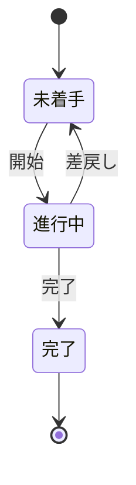
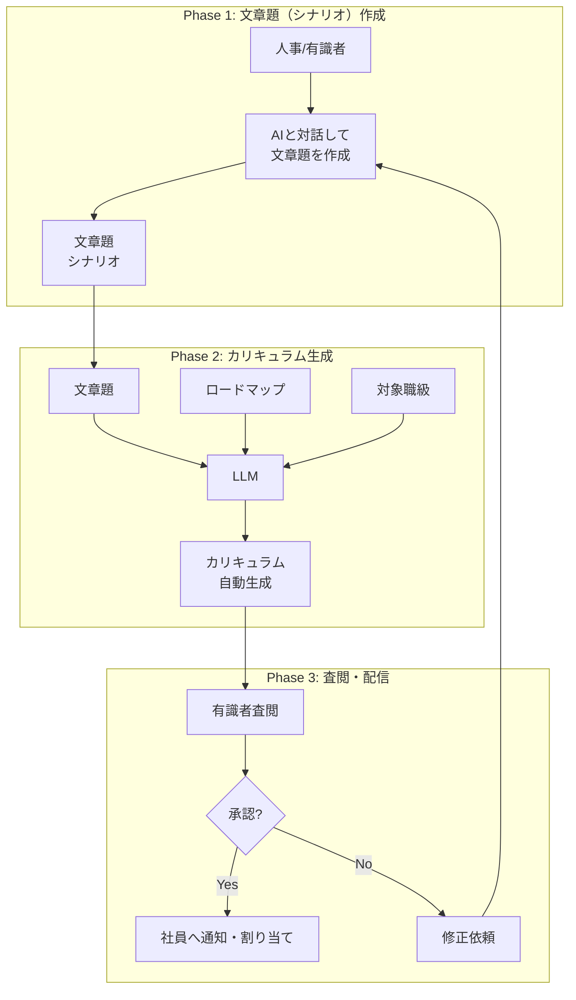
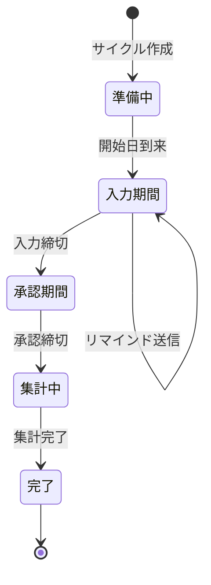
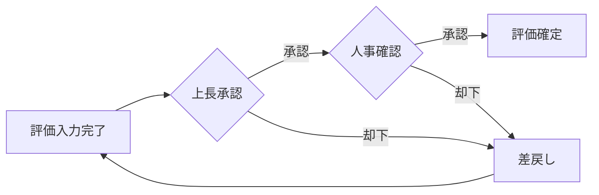
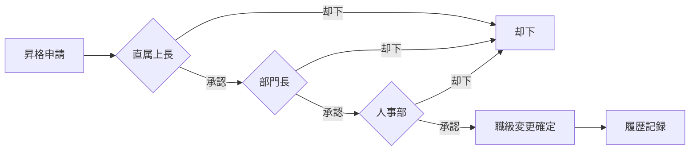
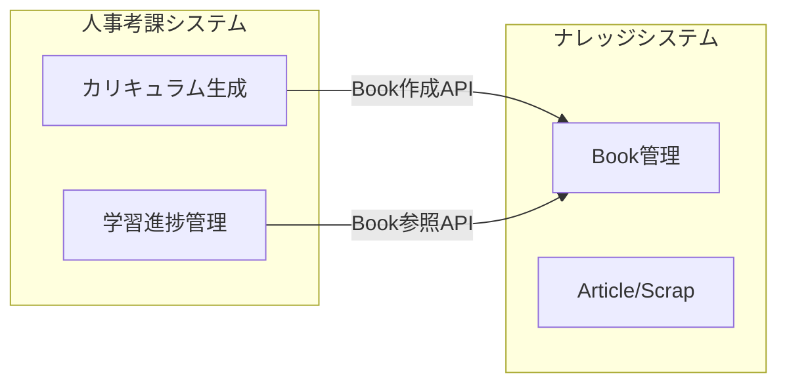
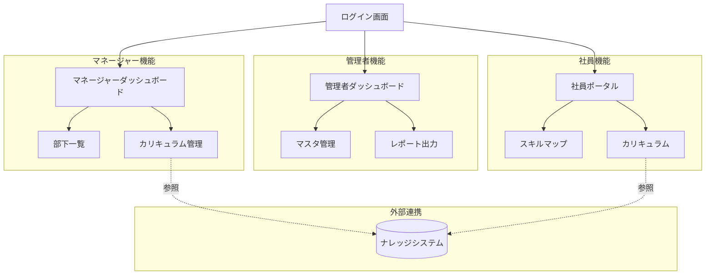

# 機能要件

---

## 1. 機能一覧

### フェーズ1（MVP）

| ID   | 機能名               | 概要                         | 優先度 |
| ---- | -------------------- | ---------------------------- | ------ |
| FR01 | 職級マスタ管理       | 職級の定義・編集・削除       | 必須   |
| FR02 | スキルカテゴリ管理   | スキル分類の管理             | 必須   |
| FR03 | スキル管理           | スキル項目の登録・編集       | 必須   |
| FR04 | ロードマップ管理     | 職級×スキルの習得目標を管理  | 必須   |
| FR05 | 情報ソース管理       | 学習リソースの登録・編集     | 必須   |
| FR06 | 社員管理             | 社員マスタの管理             | 必須   |
| FR07 | 達成状況入力         | 社員のスキル達成状況を記録   | 必須   |
| FR08 | 評価シート           | 達成率に基づく評価スコア算出 | 必須   |
| FR09 | 管理者ダッシュボード | 統計・一覧表示               | 必須   |
| FR10 | 認証・認可           | ログイン、権限管理           | 必須   |

### フェーズ2（拡張）

| ID   | 機能名               | 概要                            | 優先度 |
| ---- | -------------------- | ------------------------------- | ------ |
| FR11 | 社員ポータル         | 自分のスキルマップ確認          | 必須   |
| FR12 | カリキュラム生成     | LLMによる個別カリキュラム生成   | 必須   |
| FR13 | 学習進捗管理         | カリキュラム完了状態の追跡      | 必須   |
| FR14 | 360度フィードバック  | ピアレビュー機能                | 高     |
| FR15 | 通知機能             | メール/システム通知             | 中     |
| FR16 | レポート出力         | 評価結果のPDF/Excel出力         | 中     |
| FR17 | 評価サイクル管理     | 評価期間の開始・締切・集計      | 必須   |
| FR18 | 承認ワークフロー     | 評価・昇格の多段階承認          | 必須   |
| FR19 | 自動リマインド       | 期限前の自動通知                | 高     |
| FR20 | ナレッジシステム連携 | 外部ナレッジシステムとのAPI連携 | 高     |

---

## 2. 機能詳細

### FR01: 職級マスタ管理

**概要**: 組織の職級（L1〜L5）を定義・管理する

**アクター**: 人事管理者

**画面イメージ**:

| 職級マスタ管理 |            |                    |          |
| -------------- | ---------- | ------------------ | -------- |
| **ID**         | **職級名** | **要件概要**       | **操作** |
| L1             | Junior     | 指示のもと作業可能 | [編集]   |
| L2             | Mid-level  | 自走で業務遂行可能 | [編集]   |
| L3             | Senior     | 複雑な課題解決可能 | [編集]   |
| L4             | Lead       | チームを牽引       | [編集]   |
| L5             | Principal  | 組織全体に貢献     | [編集]   |

> 📝 詳細なワイヤーフレームは [Excalidraw](../wireframes/) を参照

**機能仕様**:

| 項目           | 内容                             |
| -------------- | -------------------------------- |
| 登録項目       | 職級ID, 職級名, 要件概要, 表示順 |
| バリデーション | 職級IDは一意、職級名は必須       |
| 制約           | 社員が紐付いている職級は削除不可 |

---

### FR02: スキルカテゴリ管理

**概要**: スキルを分類するカテゴリを管理

**アクター**: 人事管理者

**データ構造**:

```
SkillCategory
├── id: string (例: "TECHNICAL")
├── name: string (例: "テクニカルスキル")
└── description: string
```

**機能仕様**:

| 操作     | 詳細                               |
| -------- | ---------------------------------- |
| 一覧表示 | カテゴリとその配下のスキル数を表示 |
| 追加     | ID, 名称, 説明を入力               |
| 編集     | 名称, 説明を編集（IDは変更不可）   |
| 削除     | スキルが紐付いている場合は削除不可 |

---

### FR03: スキル管理

**概要**: 評価対象となるスキル項目を管理

**アクター**: 人事管理者

**データ構造**:

```
Skill
├── id: string (例: "AWS_BASICS")
├── name: string (例: "AWS基礎")
├── description: string
├── categoryId: string (→SkillCategory)
└── createdAt: datetime
```

**画面イメージ**:

| スキル管理                                       |                    |                    |          |
| ------------------------------------------------ | ------------------ | ------------------ | -------- |
| カテゴリ: [すべて ▼] 検索: [____________] [検索] |                    |                    |
| **カテゴリ**                                     | **スキル名**       | **ロードマップ数** | **操作** |
| テクニカル                                       | AWS基礎            | 5                  | [編集]   |
| テクニカル                                       | Cloudflare Workers | 4                  | [編集]   |
| ビジネス                                         | プロジェクト管理   | 3                  | [編集]   |

> 📝 詳細なワイヤーフレームは [Excalidraw](../wireframes/) を参照

---

### FR04: ロードマップ管理

**概要**: 職級×スキルの習得目標を定義

**アクター**: 人事管理者

**データ構造**:

```
RoadmapItem
├── id: string
├── skillId: string (→Skill)
├── gradeId: string (→Grade)
├── title: string
├── description: string
├── acceptanceCriteria: string[]  // 達成基準
├── estimatedHours: number        // 想定学習時間
├── learningFormat: string        // "codespaces" | "notebook" | "markdown" | "ojt" | "mixed"
└── informationSources: string[]  // →InformationSource IDs
```

**機能仕様**:

| 操作             | 詳細                                     |
| ---------------- | ---------------------------------------- |
| マトリクス表示   | 縦軸=スキル、横軸=職級のマトリクスで表示 |
| 項目追加         | スキル×職級にロードマップ項目を追加      |
| 達成基準設定     | 複数の達成基準を定義可能                 |
| 情報ソース紐付け | 学習リソースを関連付け                   |

**画面イメージ（マトリクス）**:

| ロードマップマトリクス |              |              |              |              |
| ---------------------- | ------------ | ------------ | ------------ | ------------ |
|                        | **L1**       | **L2**       | **L3**       | **L4**       |
| **AWS基礎**            | 2項目 [編集] | 3項目 [編集] | 2項目 [編集] | 1項目 [編集] |
| **Python**             | 3項目 [編集] | 4項目 [編集] | 3項目 [編集] | 2項目 [編集] |

> 📝 詳細なワイヤーフレームは [Excalidraw](../wireframes/) を参照

---

### FR05: 情報ソース管理

**概要**: 学習リソース（ドキュメント、コース等）を管理

**アクター**: 人事管理者

**データ構造**:

```
InformationSource
├── id: string
├── name: string
├── type: "DOCS" | "VIDEO" | "COURSE" | "OJT" | "INTERNAL"
├── url: string (optional)
├── mcpSupport: "full" | "partial" | "none"
├── mcpServer: string (optional)
├── priority: number
└── description: string
```

**現在登録済みの情報ソース（16件）**:

| ID          | 名称                   | 種別     | MCP対応 |
| ----------- | ---------------------- | -------- | ------- |
| AWS_DOCS    | AWS公式ドキュメント    | DOCS     | full    |
| GITHUB_DOCS | GitHub公式ドキュメント | DOCS     | full    |
| WEB_MDN     | MDN Web Docs           | DOCS     | partial |
| INTERNAL    | 社内Wiki               | INTERNAL | none    |
| ...         | （計16件）             |          |         |

---

### FR06: 社員管理

**概要**: 評価対象となる社員情報を管理

**アクター**: 人事管理者

**データ構造**:

```
Employee
├── id: string
├── name: string
├── email: string
├── department: string
├── currentGradeId: string (→Grade)
├── managerId: string (→Employee, optional)
├── joinedAt: date
├── status: "ACTIVE" | "INACTIVE"
└── updatedAt: datetime
```

**機能仕様**:

| 操作         | 詳細                         |
| ------------ | ---------------------------- |
| 一覧表示     | 部門別、職級別でフィルタ可能 |
| インポート   | CSVによる一括登録            |
| 職級変更履歴 | 過去の職級変更を記録・参照   |

---

### FR07: 達成状況入力

**概要**: 社員のスキル達成状況を記録

**アクター**: マネージャー、人事管理者

**データ構造**:

```
Achievement
├── id: string
├── employeeId: string
├── roadmapItemId: string
├── status: "NOT_STARTED" | "IN_PROGRESS" | "COMPLETED"
├── completedAt: date (optional)
├── evidence: string (optional)  // 達成のエビデンス
├── evaluatorId: string          // 評価者
├── evaluatedAt: datetime
└── comment: string (optional)
```

**画面イメージ**:

| 達成状況入力 - 社員: [山田太郎 ▼] 職級: L2 |           |            |
| ------------------------------------------ | --------- | ---------- |
| **スキル: AWS基礎**                        |           |            |
| **ロードマップ項目**                       | **状態**  | **完了日** |
| EC2基本操作を理解                          | ✅ 完了   | 2026/01    |
| S3の基本操作ができる                       | 🔄 進行中 | -          |
| IAMポリシーを理解                          | ⬜ 未着手 | -          |

**ワークフロー**:



---

### FR08: 評価シート

**概要**: 達成率に基づく評価スコアを算出・表示

**アクター**: マネージャー、人事管理者

**算出ロジック**:

```
評価スコア = Σ(重み × 達成率) / Σ(重み)

達成率 = 完了項目数 / 対象項目数 × 100

カテゴリ別重み（例）:
- テクニカルスキル: 50%
- ビジネススキル: 30%
- マネジメントスキル: 20%
```

**画面イメージ**:

| 評価シート - 山田太郎（L2） | 評価期間: 2025年度         |
| --------------------------- | -------------------------- |
| **総合達成率**              | 65% `████████████░░░░░░░░` |
| **カテゴリ別達成率**        |                            |
| テクニカル (50%)            | 80% `████████████████░░░░` |
| ビジネス (30%)              | 40% `████████░░░░░░░░░░░░` |
| マネジメント (20%)          | 70% `██████████████░░░░░░` |
| **加重平均スコア**          | **68点**                   |

操作: [評価確定] [PDF出力] [カリキュラム生成]

> 📝 詳細なワイヤーフレームは [Excalidraw](../wireframes/) を参照

---

### FR09: 管理者ダッシュボード

**概要**: 組織全体・部下のスキル状況を俯瞰

**アクター**: マネージャー、人事管理者

**表示項目**:

| ウィジェット | 内容                         |
| ------------ | ---------------------------- |
| 部下一覧     | 担当社員の達成率サマリ       |
| スキルマップ | スキル×社員のマトリクス      |
| 統計グラフ   | 職級分布、達成率分布         |
| アクション   | 未評価社員、評価期限アラート |

---

### FR10: 認証・認可

**概要**: ユーザー認証とアクセス制御

**ロール定義**:

| ロール     | 権限                                |
| ---------- | ----------------------------------- |
| ADMIN      | 全機能へのフルアクセス              |
| HR_MANAGER | マスタ管理、全社員の評価参照・編集  |
| MANAGER    | 部下の評価入力・参照                |
| EMPLOYEE   | 自分のスキルマップ参照（フェーズ2） |

**認証方式**:

- Cloudflare Access（SSO連携）
- または メール/パスワード認証

---

### FR11: 社員ポータル（フェーズ2）

**概要**: 社員が自分のスキル状況を確認できるポータル

**アクター**: 一般社員

**機能**:

| 機能             | 詳細                               |
| ---------------- | ---------------------------------- |
| スキルマップ表示 | 自分の達成状況を視覚的に表示       |
| ロードマップ確認 | 現職級の習得目標一覧               |
| カリキュラム確認 | 生成されたカリキュラムを表示       |
| 学習進捗入力     | カリキュラム項目の完了をセルフ申告 |

---

### FR12: カリキュラム生成（フェーズ2）

**概要**: 人事/有識者がAIと対話して文章題（シナリオ）を作成し、LLMが個別カリキュラムを自動生成

**アクター**: 人事管理者、有識者

**生成フロー**:



**文章題（シナリオ）の例**:

| 対象職級 | シナリオ例                                                                                   |
| -------- | -------------------------------------------------------------------------------------------- |
| G1-G2    | 「先輩から引き継いだコードにバグがあります。エラーログを見て原因を特定してください」         |
| G3       | 「新機能の設計を任されました。要件定義書をもとにAPI設計を行ってください」                    |
| M1       | 「顧客から急な仕様変更の依頼がありました。チームへの影響を考慮して対応方針を決めてください」 |
| M2-M3    | 「レガシーシステムのモダナイズ計画を立ててください。予算と期間の制約があります」             |

**カリキュラムの実体**:

カリキュラムは外部「ナレッジ管理システム」のBookとして作成・管理されます。本システムはBook
IDを参照して学習進捗を管理します。

| 要素             | 管理場所         | 説明                                 |
| ---------------- | ---------------- | ------------------------------------ |
| 文章題           | 本システム       | シナリオの管理（scenarios テーブル） |
| Bookコンテンツ   | ナレッジシステム | チャプター構成の学習コンテンツ       |
| GitHubリポジトリ | GitHub           | devcontainer付きの演習環境           |
| 割り当て・進捗   | 本システム       | 誰にどのBookを割り当てたか、進捗状況 |

**GitHubリポジトリ構成**:

```
curriculum-aws-basics/
├── .devcontainer/
│   └── devcontainer.json    # 環境定義
├── chapters/
│   ├── 01-ec2-basics/
│   ├── 02-s3-operations/
│   └── 03-iam-policies/
├── exercises/
│   └── hands-on/
└── README.md
```

**利用方法**:

| 方法              | 対象   | 説明                             |
| ----------------- | ------ | -------------------------------- |
| ローカルclone     | 全社員 | VSCode/Cursorでcloneして利用     |
| GitHub Codespaces | 希望者 | ブラウザで即座に開始（個人課金） |
| 外部共有          | 外部   | Public repoとして公開も可能      |

---

### FR17: 評価サイクル管理（フェーズ2）

**概要**: 評価期間の開始から集計までを管理するワークフロー

**アクター**: 人事管理者

**ワークフロー定義**:



**評価サイクル項目**:

| 項目       | 内容                                         |
| ---------- | -------------------------------------------- |
| サイクルID | 例: 2025-Q4, 2025-ANNUAL                     |
| 対象期間   | 開始日〜終了日                               |
| 入力締切   | マネージャーの評価入力期限                   |
| 承認締切   | 人事の最終承認期限                           |
| 対象社員   | 全社員 / 部門指定 / 個別指定                 |
| ステータス | 準備中 / 入力期間 / 承認期間 / 集計中 / 完了 |

---

### FR18: 承認ワークフロー（フェーズ2）

**概要**: 評価確定・職級変更の多段階承認を管理

**アクター**: マネージャー、人事管理者

**ワークフロー種別**:

| 種別             | 承認フロー                              | タイムアウト |
| ---------------- | --------------------------------------- | ------------ |
| 評価確定         | マネージャー入力 → 人事確認 → 確定      | 7日          |
| 職級変更         | 上長申請 → 部門長承認 → 人事承認 → 確定 | 14日         |
| カリキュラム承認 | LLM生成 → 有識者査閲 → 配信             | 3日          |

**評価承認フロー**:



**職級変更承認フロー**:



**承認タスク項目**:

| 項目             | 内容                                    |
| ---------------- | --------------------------------------- |
| タスクID         | 一意識別子                              |
| ワークフロー種別 | EVALUATION / PROMOTION / CURRICULUM     |
| 対象ID           | 評価ID / 社員ID                         |
| 現在ステップ     | 1, 2, 3...                              |
| 承認者           | 現在の承認担当者                        |
| 期限             | 承認期限                                |
| ステータス       | PENDING / APPROVED / REJECTED / TIMEOUT |

---

### FR19: 自動リマインド（フェーズ2）

**概要**: 期限前に自動で通知を送信

**アクター**: システム（自動実行）

**リマインドルール**:

| トリガー         | タイミング          | 対象者       | 内容               |
| ---------------- | ------------------- | ------------ | ------------------ |
| 評価入力期限     | 7日前、3日前、1日前 | マネージャー | 未入力の部下リスト |
| 承認待ち         | 3日前、1日前        | 承認者       | 未処理タスク一覧   |
| カリキュラム期限 | 週1回               | 社員         | 進捗状況と残タスク |
| 評価サイクル開始 | 開始日              | 全対象者     | サイクル開始通知   |

**通知チャネル**:

| チャネル                  | 用途                 |
| ------------------------- | -------------------- |
| メール                    | 主要通知、サマリー   |
| システム内通知            | リアルタイムアラート |
| Google Chat（オプション） | チーム向け通知       |

---

### FR20: ナレッジシステム連携（フェーズ2）

**概要**: 外部のナレッジ管理システムとのAPI連携

**アクター**: システム

**連携先**: ナレッジ管理システム（別プロジェクト）

**連携概要**:



**連携 API**:

| 操作           | エンドポイント                 | 説明                           |
| -------------- | ------------------------------ | ------------------------------ |
| Book作成       | `POST /api/books`              | カリキュラム生成時にBookを作成 |
| Book取得       | `GET /api/books/{id}`          | Bookの詳細情報を取得           |
| チャプター一覧 | `GET /api/books/{id}/chapters` | チャプター構成を取得           |
| チャプター詳細 | `GET /api/chapters/{id}`       | チャプター内容を取得           |

**本システムで管理するデータ**:

| データ                 | 説明                                       |
| ---------------------- | ------------------------------------------ |
| curriculum_assignments | 誰にどのBook（カリキュラム）を割り当てたか |
| learning_progress      | 各チャプターの完了状況                     |
| external_book_id       | ナレッジシステムのBook IDへの参照          |

---

## 3. 画面遷移図



---

## 4. 外部インターフェース

### 4.1 Neo4j API

| 操作         | エンドポイント      | 説明               |
| ------------ | ------------------- | ------------------ |
| スキーマ取得 | `GET /neo4j/schema` | グラフスキーマ取得 |
| Cypher実行   | `POST /neo4j/query` | Cypherクエリ実行   |

### 4.2 LLM API（フェーズ2）

| 操作             | プロバイダー         | 用途           |
| ---------------- | -------------------- | -------------- |
| カリキュラム生成 | Claude API / Bedrock | Markdown生成   |
| MCP連携          | MCP Server           | 情報ソース取得 |

### 4.3 ナレッジシステムAPI（フェーズ2）

| 操作           | エンドポイント                 | 説明                         |
| -------------- | ------------------------------ | ---------------------------- |
| Book作成       | `POST /api/books`              | カリキュラムをBookとして作成 |
| Book取得       | `GET /api/books/{id}`          | Book詳細取得                 |
| チャプター一覧 | `GET /api/books/{id}/chapters` | チャプター構成取得           |
| チャプター詳細 | `GET /api/chapters/{id}`       | チャプター内容取得           |

---

_作成日: 2026年1月24日_ _トキワテック 人事考課システム_
