# データモデル設計

本ドキュメントは、人事考課システムのデータモデルとストレージの役割分担を定義します。

---

## 1. ストレージ戦略

### 1.1 D1とNeo4jの役割分担

| ストレージ      | 用途         | データ種別                           |
| --------------- | ------------ | ------------------------------------ |
| **D1 (SQLite)** | メインDB     | トランザクションデータ、マスタデータ |
| **Neo4j**       | 分析・設計用 | スキル関係性、ロードマップ構造       |

### 1.2 設計方針

```
┌─────────────────────────────────────────────────────────────────┐
│                        データフロー                              │
├─────────────────────────────────────────────────────────────────┤
│                                                                 │
│  【D1】Source of Truth                                          │
│  ・全てのトランザクションデータ                                   │
│  ・評価期間ごとのスナップショット                                 │
│  ・実行時のクエリ対象                                            │
│                                                                 │
│  【Neo4j】設計・分析用                                           │
│  ・スキルロードマップの構造定義                                   │
│  ・スキル間の関係性（LEARNS_FROM等）                             │
│  ・キャリアパス分析（フェーズ2以降）                              │
│                                                                 │
│  【同期】                                                        │
│  ・Neo4j → D1: 評価期間開始時にロードマップをエクスポート         │
│  ・D1 → Neo4j: 必要に応じてバッチ同期（分析用）                   │
│                                                                 │
└─────────────────────────────────────────────────────────────────┘
```

---

## 2. D1 テーブル設計

### 2.1 組織ドメイン

#### departments（部署）

```sql
CREATE TABLE departments (
    id TEXT PRIMARY KEY,
    name TEXT NOT NULL,
    parent_id TEXT REFERENCES departments(id),
    created_at TEXT DEFAULT CURRENT_TIMESTAMP,
    updated_at TEXT DEFAULT CURRENT_TIMESTAMP
);
```

#### grades（職級）

```sql
CREATE TABLE grades (
    id TEXT PRIMARY KEY,
    code TEXT NOT NULL UNIQUE,          -- 'L1', 'L2', ...
    name TEXT NOT NULL,                 -- 'Entry-level', 'Mid-level', ...
    level INTEGER NOT NULL,             -- 1, 2, 3, 4, 5
    description TEXT,
    created_at TEXT DEFAULT CURRENT_TIMESTAMP,
    updated_at TEXT DEFAULT CURRENT_TIMESTAMP
);
```

#### employees（社員）

```sql
CREATE TABLE employees (
    id TEXT PRIMARY KEY,
    employee_code TEXT NOT NULL UNIQUE,
    name TEXT NOT NULL,
    email TEXT NOT NULL UNIQUE,
    department_id TEXT REFERENCES departments(id),
    grade_id TEXT NOT NULL REFERENCES grades(id),
    current_step INTEGER NOT NULL DEFAULT 1,  -- 現在の号俸
    manager_id TEXT REFERENCES employees(id),
    joined_at TEXT NOT NULL,
    status TEXT NOT NULL DEFAULT 'ACTIVE'
        CHECK (status IN ('ACTIVE', 'INACTIVE')),
    created_at TEXT DEFAULT CURRENT_TIMESTAMP,
    updated_at TEXT DEFAULT CURRENT_TIMESTAMP
);

CREATE INDEX idx_employees_department ON employees(department_id);
CREATE INDEX idx_employees_grade ON employees(grade_id);
CREATE INDEX idx_employees_manager ON employees(manager_id);
```

### 2.2 評価ドメイン

#### evaluation_periods（評価期間）

```sql
CREATE TABLE evaluation_periods (
    id TEXT PRIMARY KEY,
    name TEXT NOT NULL,                 -- '2025年度'
    start_date TEXT NOT NULL,           -- '2024-10-01'
    end_date TEXT NOT NULL,             -- '2025-09-30'
    evaluation_month INTEGER NOT NULL,  -- 9
    status TEXT NOT NULL DEFAULT 'PREPARING'
        CHECK (status IN ('PREPARING', 'ACTIVE', 'CLOSED')),
    created_at TEXT DEFAULT CURRENT_TIMESTAMP,
    updated_at TEXT DEFAULT CURRENT_TIMESTAMP
);
```

#### evaluation_criteria（評価基準）

評価期間ごとにスナップショット保存。

```sql
CREATE TABLE evaluation_criteria (
    id TEXT PRIMARY KEY,
    period_id TEXT NOT NULL REFERENCES evaluation_periods(id),
    axis_code TEXT NOT NULL
        CHECK (axis_code IN ('SKILL', 'COMPETENCY', 'BEHAVIOR')),
    axis_name TEXT NOT NULL,            -- 'スキル習得度'
    weight INTEGER NOT NULL,            -- 50 (%)
    max_score INTEGER NOT NULL,         -- 50 (点)
    target_roadmap_range TEXT,          -- 'No.1-46'
    created_at TEXT DEFAULT CURRENT_TIMESTAMP,
    UNIQUE(period_id, axis_code)
);

CREATE INDEX idx_evaluation_criteria_period ON evaluation_criteria(period_id);
```

#### evaluation_cycles（評価サイクル）

> **2025年度改訂**: 自己評価・同僚評価廃止に伴い、ステータス値を変更

```sql
CREATE TABLE evaluation_cycles (
    id TEXT PRIMARY KEY,
    period_id TEXT NOT NULL REFERENCES evaluation_periods(id),
    employee_id TEXT NOT NULL REFERENCES employees(id),
    -- 新ステータス: レポート自動生成 → 上司評価 → 承認 → 確定
    status TEXT NOT NULL DEFAULT 'REPORT_GENERATED'
        CHECK (status IN (
            'REPORT_GENERATED', 'MANAGER_EVALUATED',
            'MANAGER_APPROVED', 'HR_APPROVED',
            'FINALIZED', 'REJECTED'
        )),
    final_score REAL,                   -- 最終評価点（100点満点）
    final_rank TEXT                     -- 'S', 'A', 'B', 'C', 'D'
        CHECK (final_rank IN ('S', 'A', 'B', 'C', 'D')),
    salary_increment INTEGER,           -- 号俸アップ数
    finalized_at TEXT,
    created_at TEXT DEFAULT CURRENT_TIMESTAMP,
    updated_at TEXT DEFAULT CURRENT_TIMESTAMP,
    UNIQUE(period_id, employee_id)
);

CREATE INDEX idx_evaluation_cycles_period ON evaluation_cycles(period_id);
CREATE INDEX idx_evaluation_cycles_employee ON evaluation_cycles(employee_id);
CREATE INDEX idx_evaluation_cycles_status ON evaluation_cycles(status);
```

**ステータス遷移（新ワークフロー）:**
- `REPORT_GENERATED`: 評価期間開始時に自動生成
- `MANAGER_EVALUATED`: 上司がスコア評価完了
- `MANAGER_APPROVED`: 上司承認済み
- `HR_APPROVED`: HR承認済み
- `FINALIZED`: 確定（社員に結果開示）
- `REJECTED`: 差戻し

#### achievement_reports（達成度レポート）

> **2025年度新規**: 評価期間開始時に自動生成されるレポート

```sql
CREATE TABLE achievement_reports (
    id TEXT PRIMARY KEY,
    cycle_id TEXT NOT NULL UNIQUE REFERENCES evaluation_cycles(id),
    employee_id TEXT NOT NULL REFERENCES employees(id),
    period_id TEXT NOT NULL REFERENCES evaluation_periods(id),
    -- スナップショット情報
    employee_grade_id TEXT NOT NULL REFERENCES grades(id),
    employee_step INTEGER NOT NULL,
    base_salary INTEGER NOT NULL,
    grade_salary INTEGER NOT NULL,
    -- ロードマップ達成状況
    completion_rate REAL NOT NULL,
    total_items INTEGER NOT NULL DEFAULT 0,
    achieved_items INTEGER NOT NULL DEFAULT 0,
    in_progress_items INTEGER NOT NULL DEFAULT 0,
    strengths_json TEXT,                -- JSON配列: 達成項目名
    improvements_json TEXT,             -- JSON配列: 未達成項目名
    -- スコア（自動計算）
    skill_score_calculated REAL NOT NULL DEFAULT 0,
    skill_items_count INTEGER NOT NULL DEFAULT 0,
    skill_achieved_count INTEGER NOT NULL DEFAULT 0,
    competency_score_calculated REAL NOT NULL DEFAULT 0,
    competency_items_count INTEGER NOT NULL DEFAULT 0,
    competency_achieved_count INTEGER NOT NULL DEFAULT 0,
    behavior_score_calculated REAL NOT NULL DEFAULT 0,
    behavior_items_count INTEGER NOT NULL DEFAULT 0,
    behavior_achieved_count INTEGER NOT NULL DEFAULT 0,
    total_score_calculated REAL NOT NULL DEFAULT 0,
    suggested_rank TEXT CHECK (suggested_rank IN ('S', 'A', 'B', 'C', 'D')),
    -- スコア（上司調整後）
    skill_score_adjusted REAL,
    competency_score_adjusted REAL,
    behavior_score_adjusted REAL,
    total_score_adjusted REAL,
    final_rank TEXT CHECK (final_rank IN ('S', 'A', 'B', 'C', 'D')),
    -- 上司コメント
    manager_comment TEXT,
    strengths_comment TEXT,
    improvements_comment TEXT,
    -- タイムスタンプ
    generated_at TEXT DEFAULT (datetime('now')),
    evaluated_at TEXT,
    created_at TEXT DEFAULT CURRENT_TIMESTAMP,
    updated_at TEXT DEFAULT CURRENT_TIMESTAMP
);

CREATE INDEX idx_achievement_reports_cycle ON achievement_reports(cycle_id);
CREATE INDEX idx_achievement_reports_employee ON achievement_reports(employee_id);
CREATE INDEX idx_achievement_reports_period ON achievement_reports(period_id);
```

#### achievement_report_details（達成度レポート明細）

```sql
CREATE TABLE achievement_report_details (
    id TEXT PRIMARY KEY,
    report_id TEXT NOT NULL REFERENCES achievement_reports(id) ON DELETE CASCADE,
    roadmap_item_id TEXT NOT NULL,
    roadmap_item_number INTEGER NOT NULL,
    axis_code TEXT NOT NULL CHECK (axis_code IN ('SKILL', 'COMPETENCY', 'BEHAVIOR')),
    status TEXT NOT NULL DEFAULT 'NOT_STARTED'
        CHECK (status IN ('ACHIEVED', 'IN_PROGRESS', 'NOT_STARTED')),
    evidence TEXT,
    curriculum_completion_rate REAL,    -- カリキュラム完了率
    scenario_score REAL,                -- シナリオ平均スコア
    created_at TEXT DEFAULT CURRENT_TIMESTAMP,
    UNIQUE(report_id, roadmap_item_id)
);

CREATE INDEX idx_achievement_report_details_report ON achievement_report_details(report_id);
CREATE INDEX idx_achievement_report_details_axis ON achievement_report_details(axis_code);
```

#### self_evaluations（自己評価）

```sql
CREATE TABLE self_evaluations (
    id TEXT PRIMARY KEY,
    cycle_id TEXT NOT NULL UNIQUE REFERENCES evaluation_cycles(id),
    employee_id TEXT NOT NULL REFERENCES employees(id),
    comment TEXT,
    submitted_at TEXT,
    created_at TEXT DEFAULT CURRENT_TIMESTAMP,
    updated_at TEXT DEFAULT CURRENT_TIMESTAMP
);
```

#### self_evaluation_details（自己評価明細）

```sql
CREATE TABLE self_evaluation_details (
    id TEXT PRIMARY KEY,
    self_evaluation_id TEXT NOT NULL REFERENCES self_evaluations(id) ON DELETE CASCADE,
    roadmap_item_id TEXT NOT NULL,
    score INTEGER CHECK (score BETWEEN 1 AND 5),
    evidence TEXT,
    comment TEXT,
    created_at TEXT DEFAULT CURRENT_TIMESTAMP,
    UNIQUE(self_evaluation_id, roadmap_item_id)
);

CREATE INDEX idx_self_evaluation_details_eval ON self_evaluation_details(self_evaluation_id);
```

#### peer_evaluations（同僚評価）

```sql
CREATE TABLE peer_evaluations (
    id TEXT PRIMARY KEY,
    cycle_id TEXT NOT NULL REFERENCES evaluation_cycles(id),
    evaluator_id TEXT NOT NULL REFERENCES employees(id),
    target_employee_id TEXT NOT NULL REFERENCES employees(id),
    strengths TEXT,
    improvements TEXT,
    submitted_at TEXT,
    created_at TEXT DEFAULT CURRENT_TIMESTAMP,
    updated_at TEXT DEFAULT CURRENT_TIMESTAMP,
    UNIQUE(cycle_id, evaluator_id)
);

CREATE INDEX idx_peer_evaluations_cycle ON peer_evaluations(cycle_id);
CREATE INDEX idx_peer_evaluations_evaluator ON peer_evaluations(evaluator_id);
```

#### peer_evaluation_details（同僚評価明細）

```sql
CREATE TABLE peer_evaluation_details (
    id TEXT PRIMARY KEY,
    peer_evaluation_id TEXT NOT NULL REFERENCES peer_evaluations(id) ON DELETE CASCADE,
    roadmap_item_id TEXT NOT NULL,      -- No.74-82のみ
    score INTEGER NOT NULL CHECK (score BETWEEN 1 AND 5),
    comment TEXT,
    created_at TEXT DEFAULT CURRENT_TIMESTAMP,
    UNIQUE(peer_evaluation_id, roadmap_item_id)
);

CREATE INDEX idx_peer_evaluation_details_eval ON peer_evaluation_details(peer_evaluation_id);
```

#### manager_evaluations（上司評価）

```sql
CREATE TABLE manager_evaluations (
    id TEXT PRIMARY KEY,
    cycle_id TEXT NOT NULL UNIQUE REFERENCES evaluation_cycles(id),
    manager_id TEXT NOT NULL REFERENCES employees(id),
    target_employee_id TEXT NOT NULL REFERENCES employees(id),
    skill_score REAL,                   -- スキル習得度（/50）
    competency_score REAL,              -- 職能発揮力（/30）
    behavior_score REAL,                -- 行動・貢献（/20）
    total_score REAL,                   -- 合計（/100）
    rank_suggestion TEXT
        CHECK (rank_suggestion IN ('S', 'A', 'B', 'C', 'D')),
    overall_comment TEXT,
    submitted_at TEXT,
    created_at TEXT DEFAULT CURRENT_TIMESTAMP,
    updated_at TEXT DEFAULT CURRENT_TIMESTAMP
);

CREATE INDEX idx_manager_evaluations_manager ON manager_evaluations(manager_id);
```

#### manager_evaluation_details（上司評価明細）

```sql
CREATE TABLE manager_evaluation_details (
    id TEXT PRIMARY KEY,
    manager_evaluation_id TEXT NOT NULL REFERENCES manager_evaluations(id) ON DELETE CASCADE,
    roadmap_item_id TEXT NOT NULL,
    score INTEGER NOT NULL CHECK (score BETWEEN 1 AND 5),
    comment TEXT,
    created_at TEXT DEFAULT CURRENT_TIMESTAMP,
    UNIQUE(manager_evaluation_id, roadmap_item_id)
);

CREATE INDEX idx_manager_evaluation_details_eval ON manager_evaluation_details(manager_evaluation_id);
```

#### approval_histories（承認履歴）

```sql
CREATE TABLE approval_histories (
    id TEXT PRIMARY KEY,
    cycle_id TEXT NOT NULL REFERENCES evaluation_cycles(id),
    step TEXT NOT NULL
        CHECK (step IN ('SELF', 'PEER', 'MANAGER', 'HR')),
    action TEXT NOT NULL
        CHECK (action IN ('SUBMIT', 'APPROVE', 'REJECT')),
    actor_id TEXT NOT NULL REFERENCES employees(id),
    comment TEXT,
    previous_status TEXT,
    new_status TEXT,
    created_at TEXT DEFAULT CURRENT_TIMESTAMP
);

CREATE INDEX idx_approval_histories_cycle ON approval_histories(cycle_id);
CREATE INDEX idx_approval_histories_created ON approval_histories(created_at);
```

### 2.3 スキルドメイン

#### roadmap_items（ロードマップ項目）

```sql
CREATE TABLE roadmap_items (
    id TEXT PRIMARY KEY,
    item_number INTEGER NOT NULL UNIQUE,  -- No.1-82
    category_code TEXT NOT NULL
        CHECK (category_code IN ('SKILL', 'COMPETENCY', 'BEHAVIOR')),
    category_name TEXT NOT NULL,
    subcategory TEXT,
    title TEXT NOT NULL,
    description TEXT,
    created_at TEXT DEFAULT CURRENT_TIMESTAMP,
    updated_at TEXT DEFAULT CURRENT_TIMESTAMP
);

CREATE INDEX idx_roadmap_items_category ON roadmap_items(category_code);
CREATE INDEX idx_roadmap_items_number ON roadmap_items(item_number);
```

#### roadmap_levels（ロードマップレベル）

各職級での要件を定義。

```sql
CREATE TABLE roadmap_levels (
    id TEXT PRIMARY KEY,
    roadmap_item_id TEXT NOT NULL REFERENCES roadmap_items(id),
    grade_id TEXT NOT NULL REFERENCES grades(id),
    requirement TEXT,                   -- その職級での要件
    is_required INTEGER NOT NULL DEFAULT 0,  -- 必須かどうか
    created_at TEXT DEFAULT CURRENT_TIMESTAMP,
    UNIQUE(roadmap_item_id, grade_id)
);

CREATE INDEX idx_roadmap_levels_item ON roadmap_levels(roadmap_item_id);
CREATE INDEX idx_roadmap_levels_grade ON roadmap_levels(grade_id);
```

#### period_roadmap_snapshots（期間別ロードマップスナップショット）

評価期間開始時にロードマップをスナップショット保存。

```sql
CREATE TABLE period_roadmap_snapshots (
    id TEXT PRIMARY KEY,
    period_id TEXT NOT NULL REFERENCES evaluation_periods(id),
    roadmap_item_id TEXT NOT NULL,
    grade_id TEXT NOT NULL,
    requirement TEXT,
    is_required INTEGER NOT NULL,
    created_at TEXT DEFAULT CURRENT_TIMESTAMP,
    UNIQUE(period_id, roadmap_item_id, grade_id)
);

CREATE INDEX idx_period_roadmap_period ON period_roadmap_snapshots(period_id);
```

#### achievement_statuses（達成状況）

```sql
CREATE TABLE achievement_statuses (
    id TEXT PRIMARY KEY,
    employee_id TEXT NOT NULL REFERENCES employees(id),
    roadmap_item_id TEXT NOT NULL REFERENCES roadmap_items(id),
    status TEXT NOT NULL DEFAULT 'NOT_STARTED'
        CHECK (status IN ('NOT_STARTED', 'IN_PROGRESS', 'COMPLETED')),
    completed_at TEXT,
    evidence TEXT,
    verified_by TEXT REFERENCES employees(id),
    verified_at TEXT,
    created_at TEXT DEFAULT CURRENT_TIMESTAMP,
    updated_at TEXT DEFAULT CURRENT_TIMESTAMP,
    UNIQUE(employee_id, roadmap_item_id)
);

CREATE INDEX idx_achievement_statuses_employee ON achievement_statuses(employee_id);
CREATE INDEX idx_achievement_statuses_item ON achievement_statuses(roadmap_item_id);
CREATE INDEX idx_achievement_statuses_status ON achievement_statuses(status);
```

### 2.4 報酬ドメイン

#### base_salary_tables（基礎給テーブル）

```sql
CREATE TABLE base_salary_tables (
    id TEXT PRIMARY KEY,
    years_of_service INTEGER NOT NULL UNIQUE,
    amount INTEGER NOT NULL,
    effective_from TEXT NOT NULL,
    created_at TEXT DEFAULT CURRENT_TIMESTAMP
);
```

#### grade_salary_tables（職級給テーブル）

```sql
CREATE TABLE grade_salary_tables (
    id TEXT PRIMARY KEY,
    grade_id TEXT NOT NULL REFERENCES grades(id),
    step INTEGER NOT NULL,              -- 号俸（1-40）
    amount INTEGER NOT NULL,
    effective_from TEXT NOT NULL,
    created_at TEXT DEFAULT CURRENT_TIMESTAMP,
    UNIQUE(grade_id, step, effective_from)
);

CREATE INDEX idx_grade_salary_tables_grade ON grade_salary_tables(grade_id);
```

#### promotion_requirements（昇格要件）

```sql
CREATE TABLE promotion_requirements (
    id TEXT PRIMARY KEY,
    from_grade_id TEXT NOT NULL REFERENCES grades(id),
    to_grade_id TEXT NOT NULL REFERENCES grades(id),
    required_items TEXT,                -- JSON配列: ロードマップ項目ID
    min_score INTEGER NOT NULL,         -- 昇格試験合格ライン
    effective_from TEXT NOT NULL,
    created_at TEXT DEFAULT CURRENT_TIMESTAMP,
    UNIQUE(from_grade_id, to_grade_id, effective_from)
);
```

### 2.5 システム

#### audit_logs（監査ログ）

```sql
CREATE TABLE audit_logs (
    id TEXT PRIMARY KEY,
    user_id TEXT NOT NULL,
    action TEXT NOT NULL,
    entity_type TEXT NOT NULL,
    entity_id TEXT,
    old_value TEXT,                     -- JSON
    new_value TEXT,                     -- JSON
    ip_address TEXT,
    user_agent TEXT,
    created_at TEXT DEFAULT CURRENT_TIMESTAMP
);

CREATE INDEX idx_audit_logs_user ON audit_logs(user_id);
CREATE INDEX idx_audit_logs_entity ON audit_logs(entity_type, entity_id);
CREATE INDEX idx_audit_logs_created ON audit_logs(created_at);
```

#### notifications（通知）

```sql
CREATE TABLE notifications (
    id TEXT PRIMARY KEY,
    user_id TEXT NOT NULL REFERENCES employees(id),
    type TEXT NOT NULL,
    title TEXT NOT NULL,
    message TEXT,
    link TEXT,
    is_read INTEGER NOT NULL DEFAULT 0,
    created_at TEXT DEFAULT CURRENT_TIMESTAMP
);

CREATE INDEX idx_notifications_user ON notifications(user_id);
CREATE INDEX idx_notifications_read ON notifications(is_read);
```

#### scenarios（文章題・シナリオ）

```sql
CREATE TABLE scenarios (
    id TEXT PRIMARY KEY,
    title TEXT NOT NULL,
    description TEXT NOT NULL,
    target_grades TEXT NOT NULL,        -- JSON配列: ['G1', 'G2']
    skill_category TEXT NOT NULL,
    difficulty TEXT NOT NULL
        CHECK (difficulty IN ('BEGINNER', 'INTERMEDIATE', 'ADVANCED', 'EXPERT')),
    status TEXT NOT NULL DEFAULT 'DRAFT'
        CHECK (status IN ('DRAFT', 'ACTIVE', 'ARCHIVED')),
    created_by TEXT NOT NULL REFERENCES employees(id),
    created_at TEXT DEFAULT CURRENT_TIMESTAMP,
    updated_at TEXT DEFAULT CURRENT_TIMESTAMP
);

CREATE INDEX idx_scenarios_status ON scenarios(status);
CREATE INDEX idx_scenarios_created ON scenarios(created_by);
```

#### curriculum_assignments（カリキュラム割り当て）

```sql
CREATE TABLE curriculum_assignments (
    id TEXT PRIMARY KEY,
    employee_id TEXT NOT NULL REFERENCES employees(id),
    scenario_id TEXT NOT NULL REFERENCES scenarios(id),
    external_book_id TEXT,              -- ナレッジシステムのBook ID
    assigned_by TEXT NOT NULL REFERENCES employees(id),
    deadline TEXT,
    status TEXT NOT NULL DEFAULT 'ASSIGNED'
        CHECK (status IN ('ASSIGNED', 'IN_PROGRESS', 'COMPLETED', 'OVERDUE')),
    assigned_at TEXT DEFAULT CURRENT_TIMESTAMP,
    completed_at TEXT,
    UNIQUE(employee_id, scenario_id)
);

CREATE INDEX idx_curriculum_assignments_employee ON curriculum_assignments(employee_id);
CREATE INDEX idx_curriculum_assignments_status ON curriculum_assignments(status);
```

#### learning_progress（学習進捗）

```sql
CREATE TABLE learning_progress (
    id TEXT PRIMARY KEY,
    assignment_id TEXT NOT NULL REFERENCES curriculum_assignments(id),
    chapter_id TEXT NOT NULL,           -- ナレッジシステムのChapter ID
    status TEXT NOT NULL DEFAULT 'NOT_STARTED'
        CHECK (status IN ('NOT_STARTED', 'IN_PROGRESS', 'COMPLETED')),
    started_at TEXT,
    completed_at TEXT,
    created_at TEXT DEFAULT CURRENT_TIMESTAMP,
    UNIQUE(assignment_id, chapter_id)
);

CREATE INDEX idx_learning_progress_assignment ON learning_progress(assignment_id);
CREATE INDEX idx_learning_progress_status ON learning_progress(status);
```

---

## 3. Neo4j グラフモデル

### 3.1 ノード定義

```cypher
// 職級
(:Grade {
  id: string,
  code: string,      // 'L1', 'L2', ...
  name: string,
  level: number
})

// スキルカテゴリ
(:Category {
  code: string,      // 'SKILL', 'COMPETENCY', 'BEHAVIOR'
  name: string
})

// ロードマップ項目
(:RoadmapItem {
  id: string,
  itemNumber: number,
  title: string,
  description: string
})

// 情報ソース
(:InformationSource {
  id: string,
  name: string,
  type: string,      // 'OFFICIAL_DOC', 'BOOK', 'ONLINE_COURSE', etc.
  url: string
})
```

### 3.2 リレーションシップ定義

```cypher
// カテゴリ所属
(RoadmapItem)-[:BELONGS_TO]->(Category)

// 職級要件
(RoadmapItem)-[:REQUIRED_FOR {
  requirement: string,
  isRequired: boolean
}]->(Grade)

// 学習元
(RoadmapItem)-[:LEARNS_FROM {
  priority: number
}]->(InformationSource)

// スキル依存関係
(RoadmapItem)-[:REQUIRES]->(RoadmapItem)

// 昇格パス
(Grade)-[:PROMOTES_TO]->(Grade)
```

### 3.3 Neo4jの用途

| 用途                 | 説明                        | 頻度                     |
| -------------------- | --------------------------- | ------------------------ |
| スキル関係性の可視化 | REQUIRES関係の表示          | 低（画面表示時）         |
| 学習パスの探索       | LEARNS_FROM経路の探索       | 低（カリキュラム生成時） |
| スキルギャップ分析   | 現在スキル→必要スキルの経路 | 低（分析時）             |
| ロードマップ設計     | 新スキル追加時の影響分析    | 低（年1-2回）            |

---

## 4. データ同期

### 4.1 同期タイミング

| 方向       | タイミング     | 処理                               |
| ---------- | -------------- | ---------------------------------- |
| Neo4j → D1 | 評価期間開始時 | ロードマップをスナップショット保存 |
| D1 → Neo4j | 必要時（手動） | 社員スキル達成状況を同期（分析用） |

### 4.2 同期スクリプト

```typescript
// Neo4j → D1: ロードマップ同期
async function syncRoadmapToD1(periodId: string) {
  // 1. Neo4jからロードマップ取得
  const items = await neo4j.query(`
    MATCH (r:RoadmapItem)-[req:REQUIRED_FOR]->(g:Grade)
    RETURN r, req, g
  `);

  // 2. D1のスナップショットテーブルにINSERT
  for (const item of items) {
    await d1.exec(`
      INSERT INTO period_roadmap_snapshots
      (id, period_id, roadmap_item_id, grade_id, requirement, is_required)
      VALUES (?, ?, ?, ?, ?, ?)
    `, [...]);
  }
}
```

---

## 5. ER図（全体）

```mermaid
erDiagram
    departments ||--o{ employees : "belongs to"
    grades ||--o{ employees : "has"
    employees ||--o{ employees : "manages"

    evaluation_periods ||--o{ evaluation_criteria : "defines"
    evaluation_periods ||--o{ evaluation_cycles : "contains"
    evaluation_periods ||--o{ period_roadmap_snapshots : "snapshots"
    evaluation_periods ||--o{ achievement_reports : "generates"

    employees ||--o{ evaluation_cycles : "undergoes"
    evaluation_cycles ||--|| achievement_reports : "has"
    evaluation_cycles ||--o{ approval_histories : "tracks"

    achievement_reports ||--o{ achievement_report_details : "contains"

    roadmap_items ||--o{ roadmap_levels : "defines"
    roadmap_levels }o--|| grades : "for"

    employees ||--o{ achievement_statuses : "has"
    roadmap_items ||--o{ achievement_statuses : "tracked by"
    roadmap_items ||--o{ achievement_report_details : "referenced by"

    grades ||--o{ grade_salary_tables : "has"
    grades ||--o{ promotion_requirements : "from/to"

    employees ||--o{ notifications : "receives"
```



> **注記（2025年度改訂）**: `self_evaluations`, `peer_evaluations`, `manager_evaluations` テーブルは旧ワークフロー用として残存。新ワークフローでは `achievement_reports` を使用。

---

_トキワテック人事考課システム 2025年度版_
