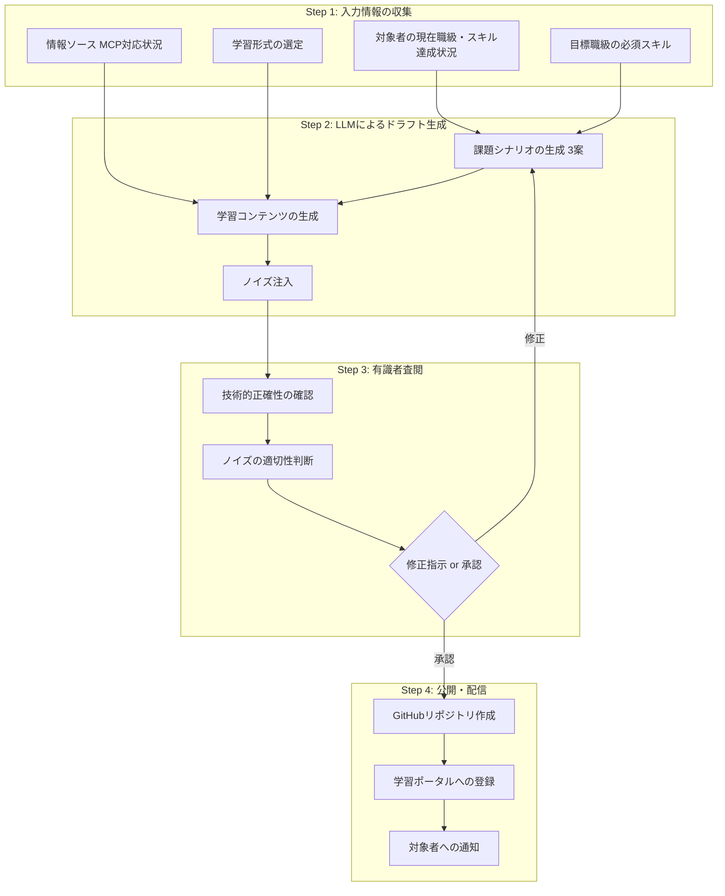

# 人事考課システム 改善提案

> 草案レビューに基づく検討事項と改善提案

---

## 1. 評価の主観性リスクへの対策

### 現状の課題

昇格試験評価スコアリングシートの評価項目が抽象的で、評価者によって解釈が異なる可能性がある。

**例：課題解決力の評価**

```
| 2. 課題解決力 | 複雑な問題の根本原因を特定し、自ら解決策を実行できるか | 20点 |
```

- 「複雑」の定義が曖昧
- 「根本原因」の判断基準が不明確
- 評価者の経験や価値観に依存

### 改善提案

#### A. エビデンスベース評価の導入

| 評価カテゴリ    | 評価の着眼点                                           | 必須エビデンス                   | 参考エビデンス       | 配点 |
| --------------- | ------------------------------------------------------ | -------------------------------- | -------------------- | ---- |
| 1. 技術的到達度 | 次のLの必須技術項目が8割以上「できる」状態か           | ロードマップチェックシート       | 資格、社内認定       | 30点 |
| 2. 課題解決力   | 複雑な問題の根本原因を特定し、自ら解決策を実行できるか | 障害報告書、設計レビュー議事録   | PRコメント、1on1記録 | 20点 |
| 3. 役割の理解   | 次の職級に求められる視座を持っているか                 | 後輩指導記録、組織貢献事例       | 360度フィードバック  | 20点 |
| 4. 実績の証跡   | 具体的エビデンスがあるか                               | 顧客評価、成果物一覧             | 表彰、社内発表       | 20点 |
| 5. 成長意欲     | 具体的計画があるか                                     | 学習計画書、カリキュラム完了証明 | 自己啓発記録         | 10点 |

#### B. 評価ルーブリックの作成

各評価項目に対して、5段階の具体的な行動指標を定義：

**例：課題解決力ルーブリック**

| スコア        | 行動指標                                                                   |
| ------------- | -------------------------------------------------------------------------- |
| 5（30点満点） | 組織横断的な課題を分析し、新規性のある解決策を立案・実行。他チームにも展開 |
| 4（24点）     | 複雑な課題の根本原因を特定し、最適な解決策を選択・実行できる               |
| 3（18点）     | 標準的な課題に対して、過去事例を参考に解決策を実行できる                   |
| 2（12点）     | 指示された解決策を実行できるが、自ら原因特定は困難                         |
| 1（6点）      | 課題解決にサポートが必要                                                   |

---

## 2. 行動特性（No.62-82）の評価方法

### 現状の課題

- 21項目が定性的で定量評価が困難
- 「主体性」「コミュニケーション」等は印象評価になりがち
- 評価者の観察機会が限られる（リモートワーク環境等）

### 改善提案

#### A. 360度フィードバックの導入

**対象:** L3以上の昇格候補者

**評価者構成:** | 評価者 | 人数 | 重み | |--------|------|------| | 上長 | 1名 |
40% | | 同僚（同チーム） | 2名 | 30% | | 後輩/関係者 | 2名 | 20% | | 自己評価 |
1名 | 10% |

**評価項目例（行動特性抜粋）:**

```markdown
【主体性・自律性】Q1. この人は、指示を待たずに自ら課題を発見し、行動を起こしていますか？1: まったくそう思わない ～ 5: 非常にそう思う

Q2. 具体的なエピソードがあれば記載してください（任意） [自由記述欄]

【コミュニケーション】Q3. この人は、技術的な内容を非エンジニアにも分かりやすく説明できますか？1: まったくそう思わない ～ 5: 非常にそう思う
```

#### B. 行動観察シートの導入

日常業務での行動を記録し、評価時の根拠とする：

| 日付      | 観察者 | 対象者 | 行動特性No.    | 観察した行動                                                   | 評価 |
| --------- | ------ | ------ | -------------- | -------------------------------------------------------------- | ---- |
| 2026/1/15 | 山田   | 飯塚   | No.74 主体性   | MTGで未定義の課題を自ら提起し、解決策を提案                    | ◎    |
| 2026/1/20 | 佐藤   | 飯塚   | No.79 対話姿勢 | 顧客との要件ヒアリングで適切な質問により潜在ニーズを引き出した | ◎    |

---

## 3. カリキュラム生成ガイドライン

### 現状の課題

- 評価制度は詳細だが、カリキュラム生成の具体的フローが未定義
- LLMへの入力仕様、有識者査閲プロセスが不明確
- 教育的ノイズの注入タイミング・方法が抽象的

### 改善提案

#### A. カリキュラム生成フロー



#### B. LLMプロンプトテンプレート

**課題シナリオ生成用:**

```markdown
## 入力情報

- 対象職級: {{targetGrade}}
- 学習スキル: {{skills}}
- 業界テーマ: {{industry}}
- 難易度: {{difficulty}}

## 情報ソース（参照必須）

{{#each informationSources}}

- {{this.name}}: {{this.url}} {{/each}}

## 生成指示

以下の条件で課題シナリオを3案生成してください：

1. 実務で直面する現実的なシナリオであること
2. 対象スキルを習得しないと解決できない構成であること
3. {{#if noiseLevel}} 教育的ノイズとして「{{noiseType}}」を1つ含めること {{/if}}

## 出力形式

各案について以下を記載：

- タイトル
- シナリオ概要（200字以内）
- 学習目標（3-5項目）
- 想定学習時間
- 含まれるノイズ（有識者確認用）
```

#### C. ノイズ注入ガイドライン

| 対象職級 | ノイズ濃度  | 推奨ノイズタイプ     | 具体例                               |
| -------- | ----------- | -------------------- | ------------------------------------ |
| L1→L2    | 低（10%）   | 情報の不完全性       | 「APIのレスポンス形式が一部未記載」  |
| L2→L3    | 中（30%）   | 技術的負債           | 「既存コードに非推奨な書き方が混在」 |
| L3→L4    | 高（50%）   | 選択肢の過剰         | 「3つのアーキテクチャ案から選定」    |
| L4→L5    | 最高（70%） | コンテキストの揺らぎ | 「途中で優先順位が変更される」       |

#### D. 有識者査閲チェックリスト

```markdown
## 査閲チェックリスト

### 技術的正確性

- [ ] 情報ソースの参照が正確である
- [ ] コードサンプルが動作する
- [ ] 使用技術のバージョンが適切である

### 教育的妥当性

- [ ] 学習目標が明確である
- [ ] 対象職級に適した難易度である
- [ ] 段階的に理解が深まる構成である

### ノイズの適切性

- [ ] ノイズが「成長につながる困難」である
- [ ] ノイズが「ただのストレス」になっていない
- [ ] ノイズの意図が明確である（査閲者向け注記あり）

### 承認

- [ ] 修正なしで公開可
- [ ] 軽微な修正後に公開可
- [ ] 大幅な修正が必要
```

---

## 4. 情報ソースのMCP対応ギャップ解消

### 現状の課題

| MCP対応状況 | 項目数 | 割合 |
| ----------- | ------ | ---- |
| 完全対応✅  | 14件   | 17%  |
| 一部対応⚠️  | 38件   | 46%  |
| 非対応❌    | 30件   | 37%  |

非対応スキル（プログラミング言語、行動特性等）のカリキュラム生成品質が課題。

### 改善提案

#### A. 優先度別MCP構築ロードマップ

| 優先度 | 対象               | アクション            | 期限目安 |
| ------ | ------------------ | --------------------- | -------- |
| **P1** | GitHub Docs        | MCP Server構築        | 2026/Q1  |
| **P2** | 社内ナレッジ       | Neo4jベクトル検索強化 | 2026/Q1  |
| **P3** | Docker/K8s         | Web検索APIラッパー    | 2026/Q2  |
| **P4** | プログラミング言語 | 言語別Docs MCP        | 2026/Q3  |

#### B. 非MCP対応スキルの代替策

| スキルカテゴリ     | 代替アプローチ                                                                 |
| ------------------ | ------------------------------------------------------------------------------ |
| プログラミング言語 | 社内コーディング規約をNeo4jに登録、公式Docsはキュレーション済みURLリストを提供 |
| 行動特性           | 社内研修資料のベクトル化、過去の評価コメントの匿名化活用                       |
| ビジネス系         | IPA資料・社内テンプレートのNeo4j登録                                           |

---

## 5. 学習形式（learningFormat）のオントロジー追加

### 現状の課題

RoadmapItemに学習形式の情報がなく、カリキュラム生成時に自動判定できない。

### 改善提案

#### A. Neo4jスキーマ拡張

```cypher
// RoadmapItemに learningFormat プロパティを追加
MATCH (r:RoadmapItem)
SET r.learningFormat = CASE
  // Codespaces: 実装・構築系
  WHEN r.no IN [11,12,13,14,15,16,20,21,22,23,24,25,26,27] THEN 'codespaces'
  // Notebook: API実験・データ分析系
  WHEN r.no IN [6,17,18,19,28] THEN 'notebook'
  // Markdown: 概念・設計系
  WHEN r.no IN [29,30,31,32,44,45,46] THEN 'markdown'
  // OJT: 行動特性系
  WHEN r.no >= 62 THEN 'ojt'
  // Mixed: その他
  ELSE 'mixed'
END
```

#### B. 学習形式の定義

| 形式           | 用途            | 対象スキルNo.      | コンテンツ生成方法           |
| -------------- | --------------- | ------------------ | ---------------------------- |
| **codespaces** | 実装演習        | 11-16, 20-27       | LLMでスケルトン+テスト生成   |
| **notebook**   | API実験・可視化 | 6, 17-19, 28       | LLMでNotebook生成            |
| **markdown**   | 概念理解        | 29-32, 44-46       | LLMで解説文書生成            |
| **mixed**      | 概念+実装       | 1-10, 33-43, 47-61 | Markdown + 軽量Notebook      |
| **ojt**        | 行動特性        | 62-82              | 評価シートのみ（生成対象外） |

---

## 6. 実装優先度マトリクス

### システム化の優先順位

| #   | 機能                   | 重要度 | 複雑度 | 依存関係 | 推奨フェーズ |
| --- | ---------------------- | ------ | ------ | -------- | ------------ |
| 1   | スキル達成状況の可視化 | 高     | 低     | -        | **Phase 1**  |
| 2   | 評価スコア自動計算     | 高     | 低     | -        | **Phase 1**  |
| 3   | learningFormat追加     | 中     | 低     | -        | **Phase 1**  |
| 4   | カリキュラム推薦       | 高     | 中     | #1, #3   | **Phase 2**  |
| 5   | LLMカリキュラム生成    | 中     | 高     | #3, #4   | **Phase 3**  |
| 6   | 有識者査閲ワークフロー | 中     | 中     | #5       | **Phase 3**  |
| 7   | 360度フィードバック    | 中     | 中     | -        | **Phase 4**  |
| 8   | 行動観察シート         | 低     | 低     | #7       | **Phase 4**  |

### フェーズ別マイルストーン


---

## 7. 追加検討事項

### A. 退職・異動時のデータ取り扱い

- 評価履歴の保持期間
- 匿名化ルール
- 360度フィードバックデータの取り扱い

### B. 評価の異議申し立てプロセス

- 異議申し立ての受付期間
- 再評価の基準
- エスカレーションフロー

### C. 外部資格との連携

- AWS認定、Google Cloud認定等の自動反映
- 外部研修の単位認定ルール

---

_トキワテック人事考課システム 改善提案 v1.0_ _作成日: 2026年1月24日_
